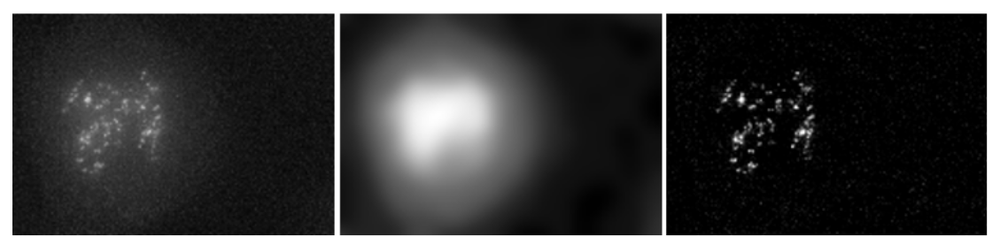

======================
Background Subtraction
======================

To process images acquired using light microscopy systems, it is often useful to correct
for inconstant background illumination and artifacts from autofluorescence.
This software removes nonlinear background. The implemented algorithm is based on the
assumption that, compared to the background region, object (foreground) regions are small.
The plugin builds local histograms and assumes the most occuring intensity to be part of
the background. The plugin is is an alternative to deletion of low frequencies in
Fourier space or the rolling ball algorithm (ImageJ standard implementation) proposed
by S.Steinberg (1983).

    Background Subtraction in action

Algorithm Description
=====================

For better algorithm understanding please refer to `Histogram-based background subtractor forImageJ <http://mosaic.mpi-cbg.de/Downloads/BGS_manual.pdf>`_ document.

