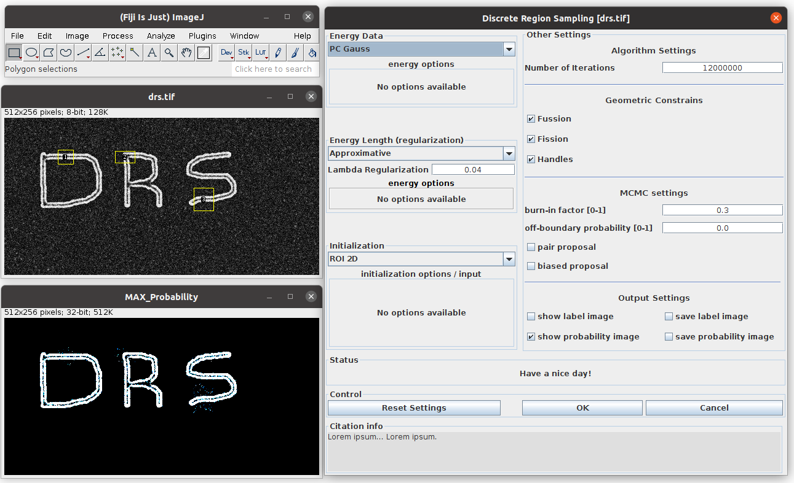

==============================
Discrete Region Sampling (DRS)
==============================

Discrete Region Sampling is a sampling version of well known Region Competition algorithm. It can be found in menu ``Segmentation > Discrete Region Sampling``.

    Discrete Region Sampling (DRS) in action

Tutorial
========

Options shared with Region Competition
--------------------------------------
Most of parameters regarding initialization, geometric constrains (fussion, fission, handles) and energies are same as in Region Competition plugin. For their
description please refere to :ref:`regionCompetition-energy-parameters`.

Options specific for DRS
------------------------
- **Number of iterations**
    Number of iteration (sampling steps) to be performed. Test run of algorithm can be done with quite
    small number of steps few hundred/thousand but for final run depending on size of a image it should be set to hundred thousands or even millions.
- **burn-in factor**
    Fraction of all iterations called **burn-in** phase during which off-boundary probability helps to explore state space.
    After **burn-in** phase off-boundary probability reduce to 0.
- off-boundary probability**
    sets the off-boundary sampling probability
- **pair proposal**
    enable mode in which each move corresponds to neighboring pair of particles
- **biased proposal**
    enables biased-proposal mode in which in order to propose smoothed shapes

For detail explanation of these parameters please refere to `PHD thesis <http://sbalzarini-lab.org/docs/Cardinale2013.pdf>`__ desribing theory behind DRS.

Developer Resources
===================
Source code and helpful information about MosaicSuite development can be found in :ref:`mosaicsuite-development` section.

Citation
========

.. admonition:: Citation

    | *J. Cardinale*
    | Unsupervised Segmentation and Shape Posterior Estimation under Bayesian Image Models. PhD thesis, Diss. ETH No. 21026, MOSAIC Group, ETH Zurich, 2013.
    | `PDF <http://sbalzarini-lab.org/docs/Cardinale2013.pdf>`__

*In order to ensure financial support for our project and allow further development of
this software, please cite above publications in all your documents and manuscripts that
made use of this software. Thanks a lot!*
