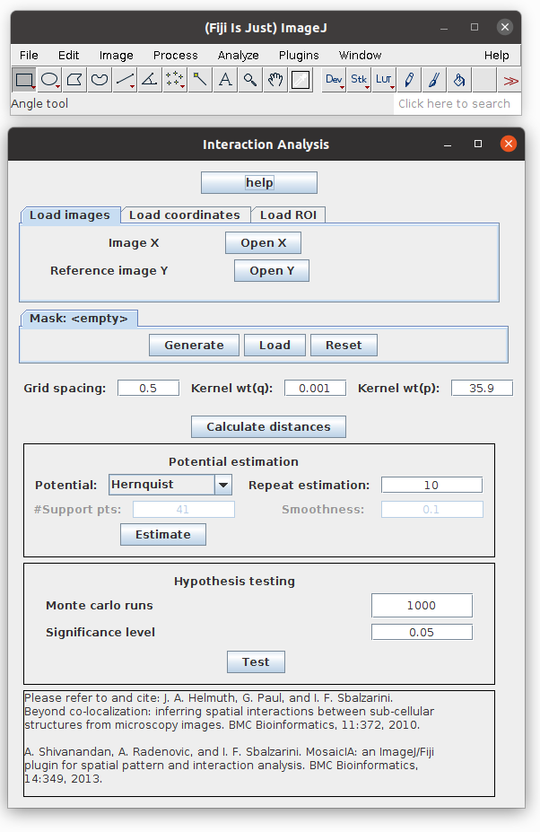

=========================
Interaction Analysis (IA)
=========================

The Interaction Analysis plugin (IA) can infer the spatial interaction between two point
patterns(sets of points).  These points can be locations of molecules, viruses, organelles,
cells, etc, in 2D or3D. Spatial interaction means the point patterns are correlated with
each other, and the absenceof this means they are independent of each other.

    Interaction Analysis in action

Tutorial
========

Nice introduction to Interaction Analysis Plugin can be found in this `PDF <http://sbalzarini-lab.org/Downloads/IAPManual.pdf>`_.
For better understanding of output please refer to :ref:`ia-citation` papers.

.. _ia-citation:

Citation
========

.. admonition:: Citation

    | *J. A. Helmuth, G. Paul, and I. F. Sbalzarini*
    | Beyond co-localization: inferring spatial interactions between sub-cellular structures from microscopy images. BMC Bioinformatics, 11:372, 2010.
    | `PDF <http://www.biomedcentral.com/1471-2105/11/372>`__

    | *A. Shivanandan, A. Radenovic, and I. F. Sbalzarini*
    | MosaicIA: an ImageJ/Fiji plugin for spatial pattern and interaction analysis. BMC Bioinformatics, 14:349, 2013
    | `PDF <http://www.biomedcentral.com/1471-2105/14/349/>`__

*In order to ensure financial support for our project and allow further development of
this software, please cite above publications in all your documents and manuscripts that
made use of this software. Thanks a lot!*
