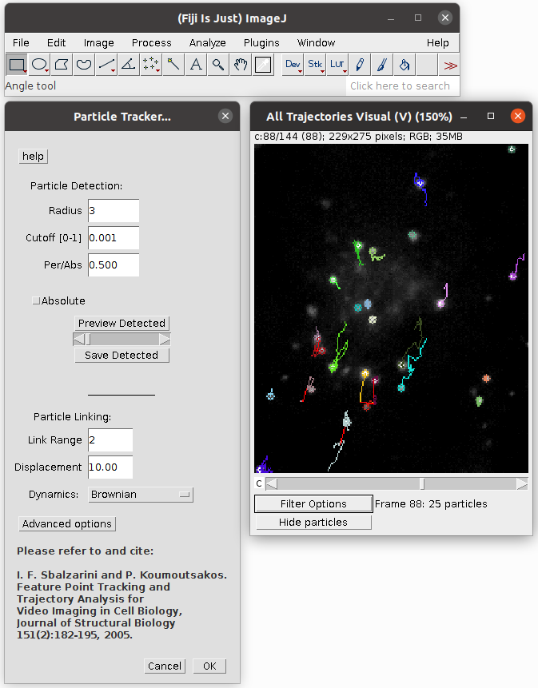

======================
Particle Tracker 2D/3D
======================

Particle Tracker (PT) is a ImageJ plugin for multiple particle detection and tracking from digital videos

    Particle Tracker in action

General Description
===================

This plugin presents an easy-to-use, computationally efficient, two- and three-dimensional, feature point-tracking tool for the automated detection and analysis of particle trajectories as recorded by video imaging in cell biology.
The tracking process requires no apriori mathematical modelling of the motion, it is self-initialising, it discriminates spurious detections, and it can handle temporary occlusion as well as particle appearance and disappearance from the image region.
The plugin is well suited for video imaging in cell biology relying on low-intensity fluorescence microscopy. It allows the user to visualize and analyze the detected particles and found trajectories in various ways:

*    Preview and save detected particles for separate analysis
*    Global non progressive view on all trajectories
*    Focused progressive view on individually selected trajectory
*    Focused progressive view on trajectories in an area of interest

It also allows the user to find trajectories from uploaded particles position and information text files and then to plot particles parameters vs. time - along a trajectory.

Tutorial
========
For detailed description and hints how to use Particle Tracker please refere to :ref:`particletracker-tutorial`.

.. toctree::
    :hidden:

    particleTrackerTutorial

Developer Resources
===================
Source code and helpful information about MosaicSuite development can be found in :ref:`mosaicsuite-development` section.

Citation
========

.. admonition:: Citation

    | *I. F. Sbalzarini and P. Koumoutsakos*
    | Feature point tracking and trajectory analysis for video imaging in cell biology. J. Struct. Biol., 151(2): 182-195, 2005.
    | `PDF <http://sbalzarini-lab.org/docs/Sbalzarini2005a.pdf>`__

*In order to ensure financial support for our project and allow further development of
this software, please cite above publications in all your documents and manuscripts that
made use of this software. Thanks a lot!*