.. _particletracker-tutorial:

=========================
Particle Tracker tutorial
=========================

This tutorial provides a basic introduction on how to select the right parameters for the algorithm of ParticleTracker and the right display and analysis options upon completion of it.

Basic Tracking
================

Preparation of data
-------------------

This tutorial is using a real experimental movie (image sequence) from
*Suomalainen et al., J. Cell Biol. 144 (4): 657-672* kindly provided by the Cell Biology group,
Institute of Zoology, University of Zurich.*

Fast minus and plus end-directed transport of endosomal ts1 virus labeled with Texas red.
Virus was added to TC7/MAP4/MTB-GFP cells and 72 TR-images were recorded with intervals
of 1.5 s starting 20 min p.i.. The GFP signal is indicated at the beginning. Bar = 10 µm.

1. Download a zipped file with images :download:`TransportOfEndosomalVirus.zip <resources/particleTracker/TransportOfEndosomalVirus.zip>`
#. After downloading the zip file, unzip it to your preferred folder and Start ImageJ.
#. Load the image sequence by selecting the ``Import > Image Sequence`` from the ``File`` menu.
#. In the first shown dialog, select one of the images in the folder (the one you unzipped) and click "Open".
#. In the second dialog specify which images in the folder to open and/or to have the images converted to 8-bits.
   When working with RGB images like the files of the experimental movie sample it is highly recommended to convert them to 8-bits. This way the memory consumption is reduced significantly.
   Check the Convert to 8-bit Grayscale box and click OK.

.. important::
    Since the plugin also supports 3D images, it is necessary to correctly set the image properties. Select Image -> Properties... from the menu. Please verfiy that the number of slices (z) and the number of frames (t) are set correctly. For this tutorial, set the number of slices to 1 and the number of frames to 144.

Run Particle Tracker
--------------------
Now, that the movie is open you can start the plugin by selecting ParticleTracker from the ``Plugins > Mosaic > Particle Tracker 2D/3D`` menu.

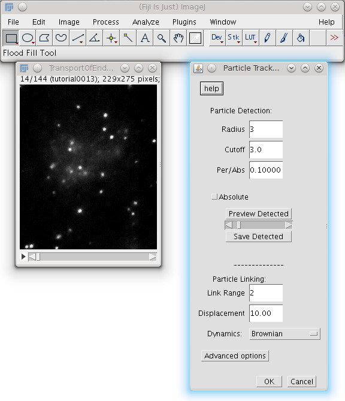

    Particle Tracker with created sequence

Select particle detection parameters and preview
------------------------------------------------
The dialog showing now has 2 parts: Particle Detection and Particle Linking.
The parameters relevant for detection are:

* **Radius**: Approximate radius of the particles in the images in units of pixels. The value should be slightly larger than the visible particle radius, but smaller than the smallest inter-particle separation.
* **Cutoff**: The score cut-off for the non-particle discrimination
* **Per/Abs**: The percentile (r) (or absolute intensity value) that determines which bright pixels are accepted as Particles. All local maxima in the upper rth percentile of the image intensity distribution ( or absolute intensity value ) are considered candidate Particles. Unit: percent (%) (or absolute intensity value)
* **Absolute**: when enable it read the Per/Abs parameter as absolute intensity value

In the particle detection part you can "play" with different parameter and check how well the particles are detected by clicking the preview detected button.
**There are no right and wrong parameters; it all depends on the movie, type of data and what is looked for.**
Enter these parameters: radius = 3, cutoff = 0, percentile = 0.1(default) - click on preview detected.

Notice the 2 very close particles marked in the image

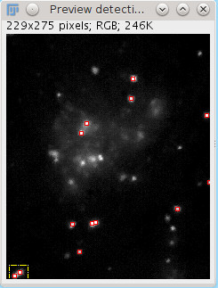

Check the detected particles at the next frames by using the slider in the dialog menu
With radius of 3 they are rightly detected as 2 separate particles.
If you have any doubt they are 2 separate particles you can look at the 3rd frame.
Change the radius to 6 and click the preview button.

Look at frame 1. With this parameter, the algorithm wrongfully detects them as one particle since they are both within the radius of 6 pixels.
Try other values for the radius parameter.

Go back to these parameters: radius = 3, cutoff = 0, percentile = 0.1(default) - click on preview detected.
It is obvious that there are more 'real' particles in the image that were not detected.
Notice, that the detected particles are much brighter then the ones not detected.
Since the score cut-off is set to zero, we can rightfully assume that increasing the percentile of particle intensity taken will make the algorithm detect more particles (with lower intensity).
The higher the number in the percentile field - the more particles will be detected.
Try setting the percentile value to 2.
After clicking the preview button, you will see that much more particles are detected, in fact too many particles - you will need to find the right balance.
In this movie, percentile value of 0.6 will give nice results.
**Remember! There is no right and wrong here - it is possible that the original percentile = 0.1 will be more suitable even with this film, if for example only very high intensity particles are of interest.**

Set the parameters to radius = 3, cutoff = 1, percentile = 0.6 - click on preview detected.
Change the cutoff parameters back to its default (3) and click preview again.
Notice the particles marked in the two pictures:

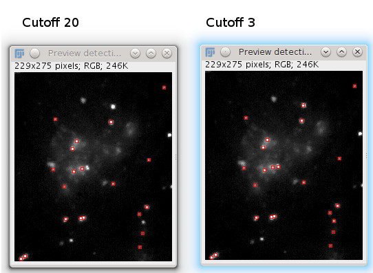

With cutoff = 3 both particle are discriminated as non-particles and when cutoff = 1 only one gets discriminated.
The higher the number in the cutoff field the more suspicious the algorithm is of false particles.
This could be very helpful when one understand the method for non-particles discrimination as described in the original algorithm.
It can also lead to real particles discrimination when the value is too high.

After setting the parameters for the detection (we will go with radius = 3, cutoff = 0, percentile = 0.6) you should set the particle linking parameters.
The parameters relevant for linking are:

* **Displacement**: The maximum number of pixels a particle is allowed to move between two succeeding frames.
* **Link Range**: The number of subsequent frames that is taken into account to determine the optimal correspondence matching.
* **Dynamics**: Type of motion of the particles, Brownian is self explanatory, constant velocity introduce a penalization term if the particle change their velocity (module and direction), straight line put a penalization term only on the direction
* **Advanced options**: A set of option to change the weight of the linking cost in the feature space and the combinatorial optimizer. Appendix for more information

These parameters can also be very different from one movie to the other and can also be modified after viewing the initial results.
Generally, in a movie where particles travel long distance from one frame to the other - a large link range should be entered.
In this movie a link range of ~20 is appropriate. Set it to 20.
The linkrange value is harder to set before viewing some initial results since it is mainly designed to overcome temporary occlusion as well as particle appearance and disappearance from the image region and it is hard to notice such things at this stage.
Still an initial value has to be set, the default is 2 but we will continue with 3.
(We will return to these parameters later with a different movie.)

You can now go ahead with the linking by clicking OK.
The progress of the algorithm will be displayed in the main ImageJ Status Bar.

Viewing the results
-------------------

After completing the particle tracking, the result window will be displayed.
Click the Visualize all Trajectories button to view all the found trajectories.

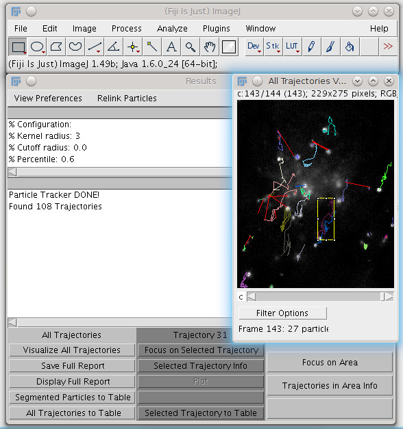

This window displays an overview of all 108 found trajectories
One way to reduce the displayed trajectories is to filter short trajectories.
Click on the Filter Options button to filter out trajectories under a given length.
Enter 144 and click OK. All the trajectories will disappear - you can also see the message in the results window "0 trajectories remained after filter".
Since the length of the movie is 144 frames there are no trajectories longer then 144 frames.
Filter again with 0 as input.
All trajectories are again displayed because by definition every trajectory length is at least 1 (spans over at least 2 frames).
Try other numbers for the filter option and notice the differences.
Set filter for 100, only 14 trajectories remained after filtering.
Select the yellow trajectory (the one shown here) by clicking it once with the mouse left button.

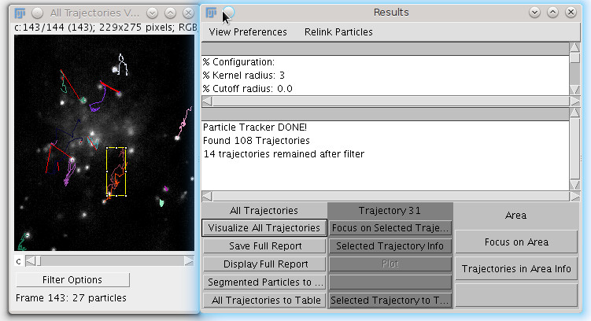

A rectangle surrounding the selected trajectory appears on the screen and on the trajectory column of the results window the number 32 is now displayed - it indicates the number of this trajectory (from the 108 found).
Now that a specific trajectory is selected you focus on it or get its information.
Click on Selected Trajectory Info button - the information about this trajectory will be displayed in the results window

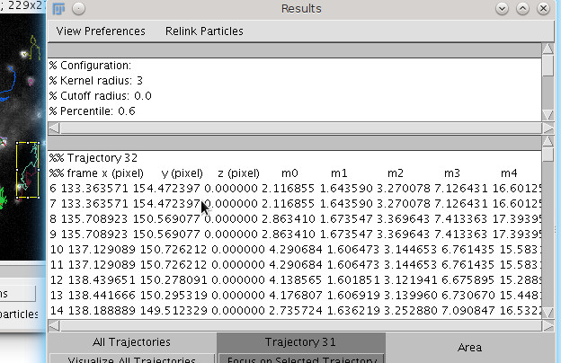

Click on the Focus on S``elected Trajectory`` button - a new window with a focused view of this trajectory is displayed.
This view can be saved with the trajectory animation through the File menu of ImageJ.
Look at the focused view and compare it to the overview window - in the focused view the white trajectory that is close to the yellow is not displayed.

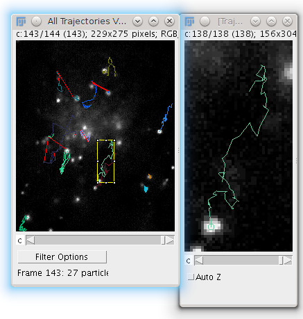

The particle and the trajectory animation is displayed.
Close this focus view.

Now we what to focus on area for number of trajectories view, we will focus on the area of the yellow and white trajectories as shown here.
Select a rectangle region of interest around these trajectories - click and drag the mouse on the overview to include them.
Click on the Focus On Area button - a new window with a focused view of these trajectories is displayed.
This time the animation of both trajectories is displayed.
Generally, any unfiltered trajectory part that is in the selected area will be shown.
You may notice that some particles are showing but their trajectory is not animated, this is because they are filtered (remember we filtered for longer then 100).
Close the focus window and reset the filter. You can do that by closing the overview window and reopening it by clicking the Visualize all Trajectories button or you can click the filter button and set the min length to 0 (default).
The last option is better since this way your area selection will stay.
Click again on the Focus on Area button - now all trajectories within the selection area is displayed.

The size of the focus window for specific trajectory and area focus is determined by the magnification factor relative to the original movie window size.
Select the pink trajectory (the one shown here). The trajectory number is 44.

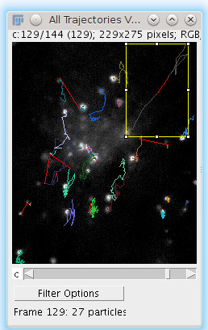

Notice that the rectangle surrounding the selected trajectory is fairly big.
If we focus on this trajectory with the default magnification factor (6) a large window will be created and may cause memory problems (especially in Mac Os).
For this reason and others - you can change the magnification factor.
Before clicking the Focus on Selected Trajectory button - go to View Preferences menu in the results window and select the Magnification Factor option.
Select magnification of 2-4.
Click on the Focus on Selected Trajectory button to see the size of the new window. Close the window.

Tracking segmented data
=======================

In order to track segmented data we will use the following :download:`Cell_track.zip <resources/particleTracker/Cell_track.zip>` as a test-case.

.. figure:: resources/particleTracker/Test_cell.*
    :scale: 75%
    :align: center

The first step is to segment this video to get the regions, for this purpose we will use Squassh. Open the Squassh plugin from ``Plugins > Mosaic > Segmentation > Squassh``.

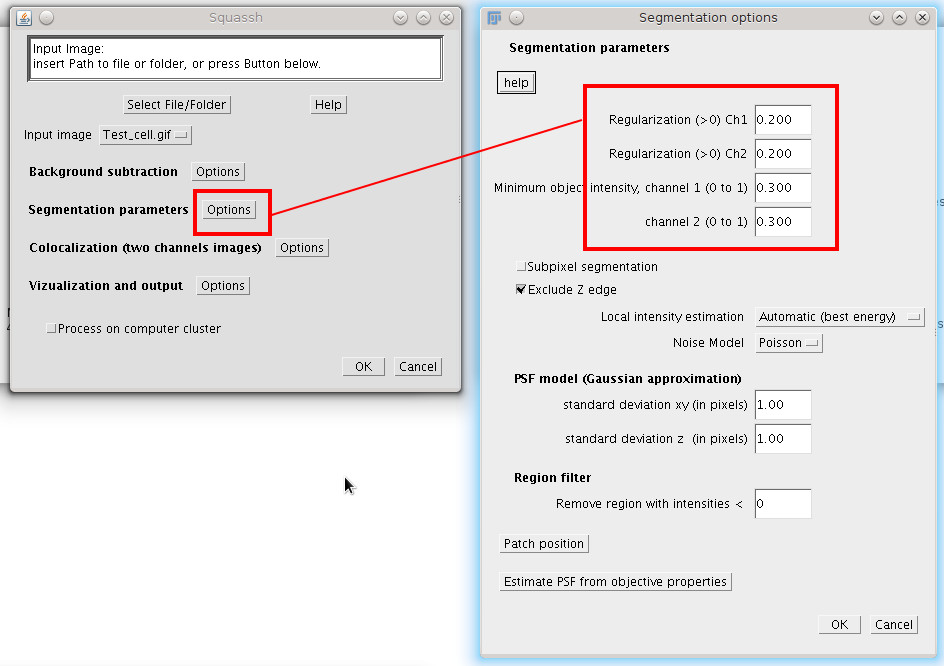

For the segmentation option set Regularization Ch1=0.200, Minimum object channel1 intensity=0.300 and PSF XY=1.0 leave the others parameters to the default one, start the segmentation pressing OK on both the windows opened. Segmenting the video can take long time, but at the end you should get a result that look like this:

.. figure:: resources/particleTracker/segmented_data.*
    :scale: 75%
    :align: center

Now open again particle tracker. The plugin detects the presence of segmented data in the folder where the image is located, if this is the case, it ask if you want to use that information for tracking.

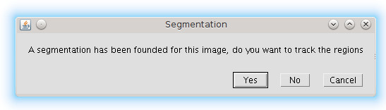

In case more than one segmentation data is found a dialog will ask to choose which one to use.

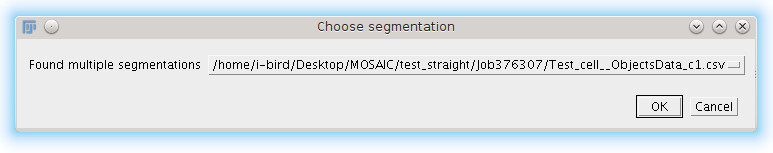

After you choose the regions data, the particle tracker window appear without the detection stage because the detection stage has been already performed by the segmentation. For this tutorial we use link range 1 and displacement 80.0.

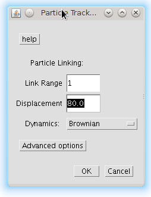

Pressing OK A new window will appear asking to filter out the region that you want to track

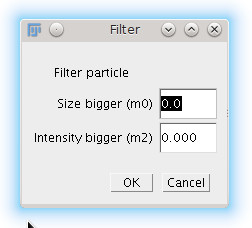

In case of segmented data and regions in general, we can decide to filter out regions by size and intensity, the following window ask for two thresholds on size and intensity, all the regions with value lower than the indicated will be removed. Set the size to 130.0 and press OK, 10 Trajectories are detected. To see the tracked regions Click on Visualize all trajectories

.. figure:: resources/particleTracker/atv_seg_trak.*
    :scale: 75%
    :align: center

This window show the tracked regions with trajectory, the sphere is centered on the center of mass of the regions and the circle size indicate the size (segmented) of the region.

Dynamic models of particle linker
=============================================

Particle Tracker after detection of particles in individual frames tries to connect them using one of dynamic models:
* **Brownian**: The Brownian model assume a brownian-like motion, so the linking cost is only based on the square of the movement between frames
* **Constant velocity**: Constant velocity, penalize links that change the velocity of a particle
* **Straight lines**: Straight lines penalize links that change direction of the particles but not their module, so they can arbitrarily accelerate. (We anyway suggest to start from constant velocity)

To illustrate the concept, we run the particle tracker on the following :download:`dataset <resources/particleTracker/Dynamic.zip>`.
On this video we see two particle that run straight and cross each other. Run the particle tracker with
Radius = 7 and leave the others parameter to the default one, choose Dynamic "Brownian" for the first run,
and "constant velocity" for the second one, you should get the following results"

.. |pic1| image:: resources/particleTracker/atv_tr_br.*
    :width: 45%

.. |pic2| image:: resources/particleTracker/atv_tr_lin.*
    :width: 45%

|pic1| |pic2|

Different dynamic models produce different linking results, in the first case, "brownian motion",
we do not assume any specific dynamic model, the penalization is only related to its spatial movement,
so if the link change completely direction the penalization is small until the spatial movement is small ,
in the case of constant velocity we penalize link that change the speed of the particles direction and module,
This produces more straight lines trajectory. Straight lines penalize links that change direction of
the particles but not their module, so they can arbitrarily accelerate.
(We anyway suggest to start from constant velocity)

Advanced options
================

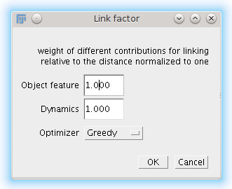

The linking stage has the purpose to link one particle at frame n to frame n+1 or more in general two particles at two different time positions, this involve the calculation of linking costs and a combinatorial optimizer to find the best linking configuration. A link involve 3 different terms

* **Space**: 	introduce a cost if the particle move spatially across frames, it is set to 1.0 and cannot be changed
* **Feature**: 	introduce a cost if the particle change features across frames: intensity, size (in case of region tracking), p-momenta intensities
* **Dynamics**: 	introduce a cost if the particle does not follow the specified dynamic model across frames

The advanced options give the possibility to change the weight of the cost terms and choose the combinatorial optimizer.

Re-linking particles
====================

To explain the re-linking option we will use a different data sample - Artificial.zip.
Close all windows including the original movie window.
Load the new image sequence from Artificial.zip and start the plugin.
Set the particle detection parameters to: radius = 3, cutoff = 3.0, percentile = 0.9.
Set the particle linking parameters to: link range = 1, displacement = 10.
Start the algorithm and when it's done, click the View all Trajectories button.
Zoom in on the overview window for better view.
Select an area of interest to include the 2 adjacent blue and grey trajectories as shown here.

.. figure:: resources/particleTracker/blue_gray\ trajectories_cropped.png
    :scale: 75%
    :align: center

Increase the magnification factor to 8 and focus on that area.
Scroll through the focused view or view it with animation (Image -> Stacks -> Start Animation).
It seems that these two trajectories are actually 1 longer trajectory.
Why was it recognized as 2 trajectories? Scroll to slice/frame 71?
At this point, the detection algorithm, due to the set detection parameters and bad quality of the movie, did not detect the particle. This can also happen in real biological data.
Since the link range was set to 1 - the linking algorithm did not look ahead to frame 72 to check for a possible continuation to the trajectory.
Re-link the particle with link range = 2, go to the Relink Particles menu at the results window and select the set new parameters for linking.
In the dialog now opened - set the link range to 2 and click OK.
When the re linking is done, a message will be displayed in the results window: Relinking DONE! Found 10 Trajectories

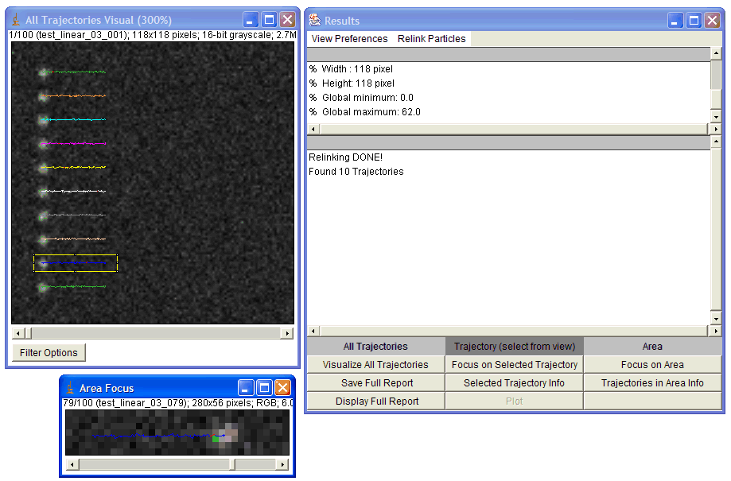

You can already see that fewer trajectories were found (10 instead on 17).
Click on the View all Trajectories button and compare the view to the one created with link range = 1.
Focus on the blue trajectory.
The previously 2 separate trajectories are now 1 and in frame 71, were the particle was not detected, a red line is drawn to indicate a "Gap" in the trajectory - meaning a part in the trajectory that was interpolated by the algorithm to handle occlusion, exit and entry of the particle.

