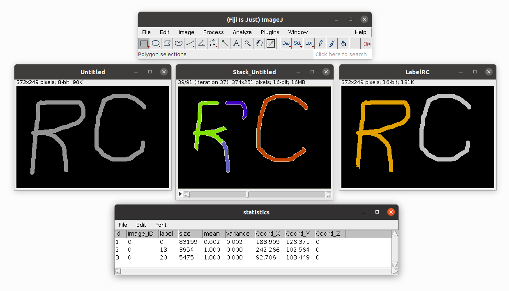

=======================
Region Competition (RC)
=======================

Region Competition plugin is based on the MOSAIC Discrete Region Competition algorithm for image segmentation.

    Region Competition (RC) in action

Developer Resources
===================
Source code and helpful information about MosaicSuite development can be found in :ref:`mosaicsuite-development` section.

Tutorial
========

Input/Output
------------

Algorithm requires following inputs:

- **Image source** Can be in any format recognized by ImageJ, the image is automaticaly converted into a floating point intensity image
- **Energy function** The segmentation is driven by the minimization of an energy function. In this plugin several energy functions or combinations of energy functions can be selected. In the following we introduce briefly all them, but for a complete explanation of which one use and in which situation look in the region competition paper.
- **Energy function parameters** The energy function in general have free parameter, that should be setted by the user or initialized to some default value
- **Label image source (optional)** This is an optional image that defines the initial segmentation from which the algoritm should start. If not given the default behaviour is to use an autogenerated starting labels image.

Output of a plugin:

- **Label output image** Output with segmentation, each found region is labelled with different color.
- **Animated iteration sequence**  Is the evolution of the segmentation produced by the algorithm, can be saved in all imageJ supported formats.
- **Statistics** Information about found regions like size, coordinates, mean intensity, label etc.

.. _regionCompetition-energy-parameters:

Energy function parameters
--------------------------

Press Parameters button in the main window, you can tune global parameters like the maxium number of iteration and the oscillation threshold that control the convergence of the algorithm. You can also tune global parameters related to the energy, like Lambda and Theta that we will explain below.

.. figure:: resources/regionCompetition/RegionPAR.jpg
    :scale: 75%
    :align: center

- **Lambda E length**
    Lambda E length: Is a scaling factor for the Energy length, this term in general is sensitive to the shape of the region
- **Theta E merge**
    Factor needed for the merging energy function, this term implements model that controls the merging of two regions
- **Max Iteration**
    Maximum number of iterations
- **Oscillation Threadshold**
    This parameter controls the convergence of the algorithm in this way, at each iteration the global energy is stored, the standard deviation is calculated along all history and starting from the last 10 iterations.
- **E data**
    This is the Energy part that depend from the input image, each model have an "options window" that can be opened pressing the near "Options" button. Energies that are possible to choose:

    - PC
        No Additional options are available.

        .. figure:: resources/regionCompetition/E_pc.jpg
            :scale: 75%
            :align: center

    - PS
        **Radius**: Radius of the sphere where the mean of the intensity is calculated

        **Beta Balloon force**: Beta controls the strenght of the Balloon force

        .. figure:: resources/regionCompetition/E_ps.jpg
            :scale: 75%
            :align: center

    - Deconvolution
        **Open PSF Image**: Open an image and use it as Point Spread Function

        **Generate**: Generate a gaussian PSF Image, before starting the simulation

        .. figure:: resources/regionCompetition/E_dev.jpg
            :scale: 75%
            :align: center

- **E length (Energy Length model)**
    From a practical point of view, this energy locally reduces concavity, tips , and globally the length of the countor region.

    - Sphere Regularization
        *Radius*: Radius of the hypersphere in the curvature regularization. The image show what happen when the segmentation is driven only by the Sphere Regularization energy term.

        .. |pic1| image:: resources/regionCompetition/Cont_lenght_lf.*
            :width: 45%

        .. |pic2| image:: resources/regionCompetition/E_lenght.jpg
            :width: 45%

        |pic1| |pic2|

    - Approximative
        Countor length regularization, no other parameters needed.

        .. figure:: resources/regionCompetition/E_lenght_approximative.jpg
            :scale: 75%
            :align: center

- **Energy Merge**
    Kullback-Leibler: This parameter is controlled in the global region competition parameters (Theta E Merge)

        .. figure:: resources/regionCompetition/E_merge.jpg
            :scale: 75%
            :align: center

- **Initialization**
    - Bubbles
        Create a grid of bubbles with a specified radius and padding

        .. figure:: resources/regionCompetition/bubbles.jpg
            :scale: 75%
            :align: center

    - Rectangle
        Create a rectangle in the center of the image, the ratio is the division of the side of the rectangle with the side of the image on each dimension.

        .. figure:: resources/regionCompetition/Rectangle.jpg
            :scale: 75%
            :align: center

    - ROI
        Before the simulation start, the normalized intensity image is shown, and it ask to user to draw a starting region using the selection tools of ImageJ, when done press shift to start the simulation.

    - Local Maxima
        the initial regions are created around the local maxima of the image, and the following three steps are performed.

        - **Sigma**: The first stage is to apply a gaussian blur filter to the image with sigma variance.
        - **Tolerance**: Find out the locals maxima according to the tollerance parameter. The maxima are accepted only if protruding more than this value from the ridge to a higher maximum. High value of tollerance means that only high local maxima will be accepted, reducing the Tolerance, increases the group of possible maxima accepted (from left to right in the image)
        - **Region Tol**: Filter the regions found such that: If the region is smaller that "Region Tol", creates a bubble with radius (Radius) *1*, otherwise leave the region unchanged *2*

        .. figure:: resources/regionCompetition/LocalMaxima.jpg
            :scale: 75%
            :align: center

- **Handle/Fission/Fusion**
    The algorithm is able to manage changes of topology, you can enable or disable the creation of handles, and fission and fusion of regions.

    .. |p1| image:: resources/regionCompetition/Ball_region_ffusion.*
    .. |p2| image:: resources/regionCompetition/Ball_region_fusion.*
    .. |p3| image:: resources/regionCompetition/flo_fission.*
    .. |p4| image:: resources/regionCompetition/flo_no_fission.*
    .. |p5| image:: resources/regionCompetition/Ball_with_holes_H.*
    .. |p6| image:: resources/regionCompetition/Ball_with_holes_nH.*

    ==== ==== ==== ==== ==== ====
    fusion    fission   handles
    --------- --------- ---------
    on   off  on   off  on   off
    ==== ==== ==== ==== ==== ====
    |p1| |p2| |p3| |p4| |p5| |p6|
    ==== ==== ==== ==== ==== ====

Other options
-------------

    - **Keep frames**: Save all frames produced by the algorithm
    - **Normalize input image**: Normalize input image before processing
    - **Show and save statistics**: Show statistics of the segmentation

Examples
========

    .. |e1| image:: resources/regionCompetition/nucleisInput.jpg
            :width: 45%
    .. |e2| image:: resources/regionCompetition/nucleis.*
            :width: 45%

    .. |e3| image:: resources/regionCompetition/icecream5_410x410.jpg
            :width: 45%
    .. |e4| image:: resources/regionCompetition/icecream5_rs.*
            :width: 45%

    .. |e5| image:: resources/regionCompetition/endoInput.jpg
            :width: 45%
    .. |e6| image:: resources/regionCompetition/endo.*
            :width: 45%

    .. |e7| image:: resources/regionCompetition/uc_data.jpg
            :width: 45%
    .. |e8| image:: resources/regionCompetition/Dev_res_rs.*
            :width: 45%

    |e1| |e2|

    |e3| |e4|

    |e5| |e6|

    |e7| |e8|

Citation
========

.. admonition:: Citation

    | *J. Cardinale, G. Paul, and I. F. Sbalzarini*
    | Discrete region competition for unknown numbers of connected regions. IEEE Trans. Image Process., 21(8):3531–3545, 2012.
    | `PDF <http://sbalzarini-lab.org/docs/Cardinale2012.pdf>`__

*In order to ensure financial support for our project and allow further development of
this software, please cite above publications in all your documents and manuscripts that
made use of this software. Thanks a lot!*
