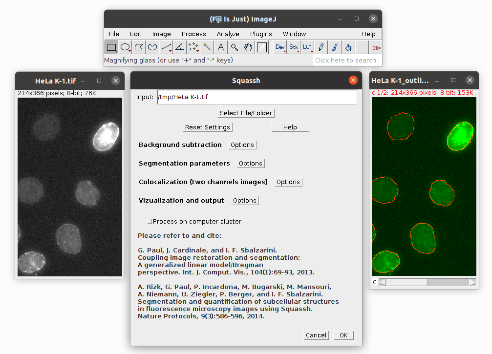

=======
Squassh
=======

The Squassh plugin can be used for globally optimal segmentation of piecewise constant regions in 2D and 3D
images and for object-based co-localization analysis. Globally optimal segmentation is very fast and independent
of initialization, but it is currently limited to objects with homogeneous (i.e., constant) internal intensity.
The method can also produce sub-pixel accurate results.

    Squassh in action
    *(Picture courtesy of Dr. Magdalena Gonciarz, Mansfeld Lab: HeLa K cells expressing LMNA-GFP)*

Tutorial
========

Tutorial / workflow
-------------------

Nice introduction to work with Squassh can be found in following documents:

- | *A. Rizk, G. Paul, P. Incardona, M. Bugarski, M. Mansouri, A. Niemann, U. Ziegler, P. Berger, and I. F. Sbalzarini*
  | Segmentation and quantification of subcellular structures in fluorescence microscopy images using Squassh. Nature Protocols, 9(3):586–596, 2014,
  | `PDF <http://mosaic.mpi-cbg.de/docs/Rizk2014.pdf>`__
- | *Aurélien Rizk, Grégory Paul, Pietro Incardona, Milica Bugarski, Maysam Mansouri, Axel Niemann, Urs Ziegler, Philipp Berger, Ivo F. Sbalzarini*
  | An ImageJ/Fiji plugin for segmenting and quantifyingsub-cellular structures in fluorescence microscopy images
  | `PDF <http://mosaic.mpi-cbg.de/Downloads/SplitBregmanSeg.pdf>`__

Video Tutorial
--------------
    Video tutorial explaining step by step how to install MosaicSuite in Fiji and how to use Squassh.

.. only:: html

     .. raw:: html

        <video controls src="http://mosaic.mpi-cbg.de/Downloads/Squassh_video.m4v" width="720" height="540"></video>

.. only:: latex

    `Squassh video tutorial <http://mosaic.mpi-cbg.de/Downloads/Squassh_video.m4v>`__

Developer Resources
===================
Source code and helpful information about MosaicSuite development can be found in :ref:`mosaicsuite-development` section.

Citation
========

.. admonition:: Citation

    | *G. Paul, J. Cardinale, and I. F. Sbalzarini*
    | Coupling image restoration and segmentation: A generalized linear model/Bregman perspective. Int. J. Comput. Vis., 2013.
    | `PDF <http://mosaic.mpi-cbg.de/docs/Paul2013a.pdf>`__, `Supplementary Material PDF <http://mosaic.mpi-cbg.de/docs/Paul2013b.pdf>`__, `Matlab Implementation <http://mosaic.mpi-cbg.de/?q=downloads/splitBregman>`__
    |
    | *A. Rizk, G. Paul, P. Incardona, M. Bugarski, M. Mansouri, A. Niemann, U. Ziegler, P. Berger, and I. F. Sbalzarini*
    | Segmentation and quantification of subcellular structures in fluorescence microscopy images using Squassh. Nature Protocols, 9(3):586–596, 2014.
    | `PDF <http://mosaic.mpi-cbg.de/docs/Rizk2014.pdf>`__, `Supplementary Note PDF <http://mosaic.mpi-cbg.de/docs/Rizk2014a.pdf>`__, `Supplementary Data ZIP <http://mosaic.mpi-cbg.de/docs/Rizk2014_supplement.zip>`__, `Supplementary Video <http://mosaic.mpi-cbg.de/Downloads/Squassh_video.m4v>`__

*In order to ensure financial support for our project and allow further development of
this software, please cite above publications in all your documents and manuscripts that
made use of this software. Thanks a lot!*
